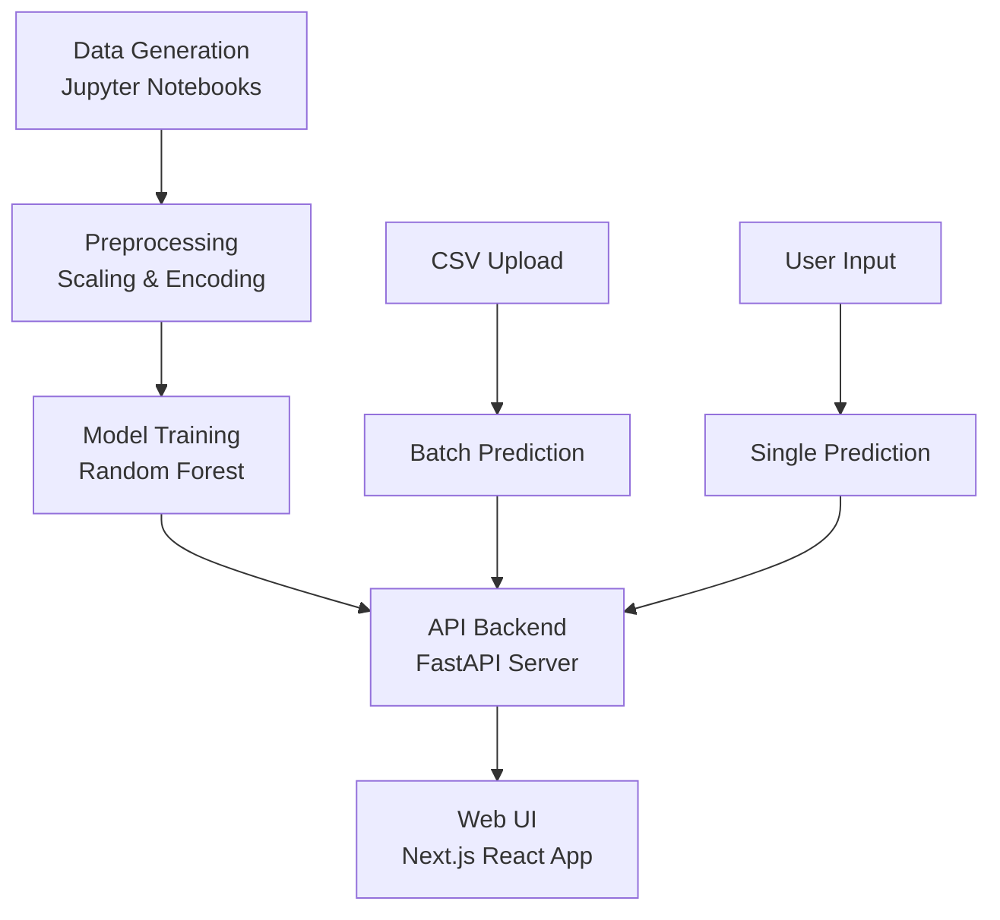
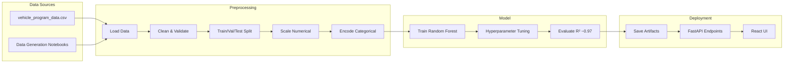
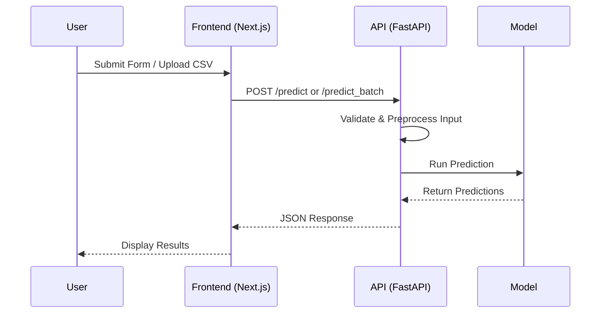

# CAPEX Estimation Project

A complete end-to-end machine learning application for estimating Capital Expenditure (CAPEX) in manufacturing projects, specifically for vehicle production lines. This project includes data generation, preprocessing, model training, a REST API, and a web-based user interface.

## Features

- **Data Pipeline**: Synthetic data generation for realistic manufacturing scenarios
- **Preprocessing**: Automated feature engineering with categorical encoding and numerical scaling
- **Model Training**: Random Forest Regressor with hyperparameter tuning (R² ~0.97)
- **API Backend**: FastAPI server with prediction endpoints
- **Web UI**: Next.js React application for single and batch predictions
- **Batch Processing**: CSV upload for bulk predictions
- **Logging**: Comprehensive logging for pipeline and API activities

## Project Structure

```
├── data/
│   ├── vehicle_program_data.csv          # Main dataset (1000 rows, 19 features + target)
│   ├── data_generation.ipynb             # Synthetic data creation
│   ├── feature_engineering.ipynb         # EDA and preprocessing experiments
│   └── ...
├── models/
│   ├── rf_model.pkl                      # Trained Random Forest model
│   ├── preprocessor.pkl                  # Fitted preprocessing pipeline
│   └── feature_order.pkl                 # Feature column order
├── src/
│   ├── backend/
│   │   └── app.py                        # FastAPI server
│   ├── frontend/                         # Next.js React app
│   ├── preprocessing.py                  # Data cleaning and transformation
│   ├── train.py                          # Model training utilities
│   ├── model_inference.py                # Prediction logic
│   └── main.py                           # Main pipeline script
├── requirements.txt                      # Python dependencies
├── myenv/                                # Virtual environment
└── README.md
```

## Installation

### Prerequisites
- Python 3.8+
- Node.js 16+
- Git

### Backend Setup
1. Clone the repository:
   ```bash
   git clone <your-repo-url>
   cd cost-estimation
   ```

2. Create and activate virtual environment:
   ```bash
   python -m venv myenv
   myenv\Scripts\activate  # Windows
   # source myenv/bin/activate  # Linux/Mac
   ```

3. Install Python dependencies:
   ```bash
   pip install -r requirements.txt
   ```

### Frontend Setup
1. Navigate to frontend directory:
   ```bash
   cd src/frontend
   ```

2. Install Node.js dependencies:
   ```bash
   npm install
   ```

## Usage

### Training the Model
Run the complete pipeline (data loading, preprocessing, training):
```bash
cd src
python main.py
```
This will:
- Load data from `data/vehicle_program_data.csv`
- Preprocess features
- Train Random Forest model
- Save artifacts to `models/`

### Running the API
Start the FastAPI server:
```bash
cd src
uvicorn backend.app:app --reload
```
API will be available at `http://localhost:8000`
- Interactive docs: `http://localhost:8000/docs`

### Running the Frontend
Start the Next.js development server:
```bash
cd src/frontend
npm run dev
```
UI will be available at `http://localhost:3000`

## API Endpoints(Example)

### Single Prediction
```http
POST /predict
Content-Type: application/json

{
  "Vehicle_Type": "Hatchback",
  "Material_Type": "Steel",
  "Drivetrain": "ICE",
  "Automation_Level": "Low",
  "Plant_Age": "20+ yrs",
  "Line_Reuse": "Yes",
  "Lifetime_Volume": 131724,
  "Target_Annual_Volume": 16465.5,
  "Variants": 4,
  "Number_of_Parts": 454,
  "Avg_Part_Complexity": 2.246,
  "BIW_Weight": 954.865,
  "Stamping_Dies": 104,
  "Injection_Molds": 91,
  "Casting_Tools": 45.0,
  "Jigs_and_Fixtures": 70,
  "Assembly_Line_Equipment": 18.16,
  "Robotics": 3.037,
  "Paint_Shop_Mods": 5.321
}
```

### Batch Prediction
```http
POST /predict_batch
Content-Type: application/json

{
  "data": [
    { /* same as single prediction */ },
    { /* another record */ }
  ]
}
```

### Get Categories
```http
GET /categories
```
Returns available options for categorical fields.

### Feature Importance
```http
GET /feature_importance?n=10
```
Returns top N most important features.

## Data Format

The input data should match the format of `vehicle_program_data.csv`:

**Categorical Fields:**
- Vehicle_Type: Hatchback, SUV, EV Sedan, Pickup
- Material_Type: Steel, Aluminum, Composite
- Drivetrain: ICE, Hybrid, EV
- Automation_Level: Low, Medium, High
- Plant_Age: New, 5-10 yrs, 10-20 yrs, 20+ yrs
- Line_Reuse: Yes, No

**Numerical Fields:**
- Lifetime_Volume, Target_Annual_Volume, Variants, Number_of_Parts, Avg_Part_Complexity, BIW_Weight, Stamping_Dies, Injection_Molds, Casting_Tools, Jigs_and_Fixtures, Assembly_Line_Equipment, Robotics, Paint_Shop_Mods

**Target:** Estimated_CAPEX ($M)

## Model Performance

- **Algorithm**: Random Forest Regressor
- **Validation R²**: ~0.97
- **Test R²**: ~0.97
- **Top Features**: Variants, Line_Reuse, Avg_Part_Complexity, Number_of_Parts, Target_Annual_Volume

## Architecture

```
Data Generation → Preprocessing → Model Training → API → Web UI
     ↓              ↓              ↓          ↓       ↓
  Notebooks     Scaling +       Random     FastAPI  Next.js
  (Jupyter)     Encoding        Forest     Server   React
```

### Architecture Diagram



### Data Pipeline Diagram



### API Flow Diagram



## Development

### Adding New Features
1. Update preprocessing in `src/preprocessing.py`
2. Retrain model with `python main.py`
3. Update API schemas in `src/backend/app.py`
4. Update frontend form in `src/frontend/app/predict/page.js`

### Testing
- Run pipeline: `python src/main.py`
- Test API: Use `/docs` or tools like Postman
- Test frontend: `npm run dev` and interact with UI

## Troubleshooting

<!-- ### Common Issues
- **Module not found**: Ensure virtual environment is activated
- **API fails to load**: Check model files exist in `models/`
- **Frontend errors**: Ensure backend is running on port 8000
- **CSV parsing**: Ensure batch CSV has no header and correct column order -->

### Logs
- Pipeline logs: `src/Capex_Estimation_Pipeline.log`
- API logs: `src/Capex_Estimation_API.log`

## Contributing

1. Fork the repository
2. Create a feature branch
3. Make changes
4. Test thoroughly
5. Submit a pull request

## License

[Add your license here]

## Contact

[Add contact information]
